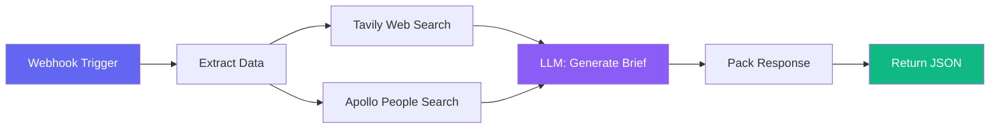
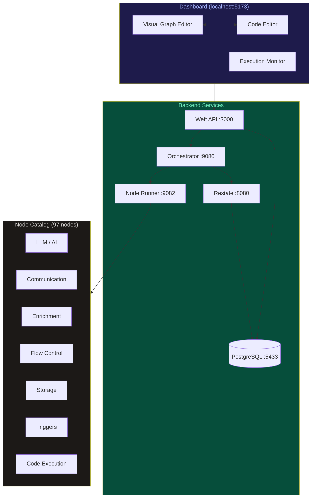
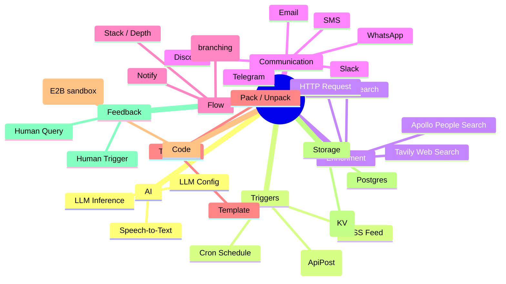
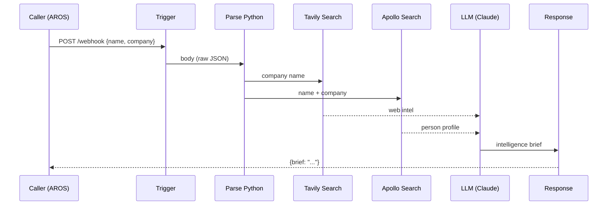
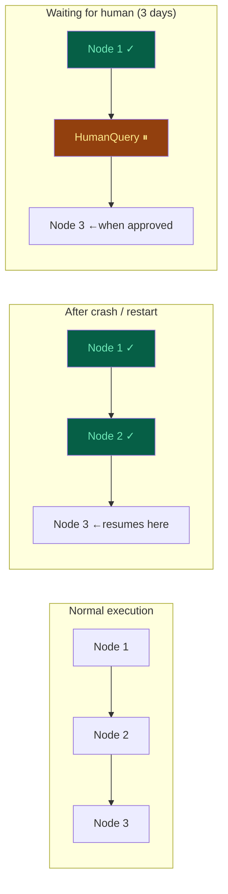

# Weft — AI Programming Language

> Wire LLMs, humans, APIs, and infrastructure together. The compiler checks the architecture. You get a live visual graph of your program automatically.

```
LLM calls · Human approvals · Web search · Code execution · APIs · Databases · Notifications
All first-class. No plumbing.
```

---

## What is Weft?

Most AI systems today are built by duct-taping libraries together: call an LLM, parse the response, call an API, manage state, handle failures, route to a human when something goes wrong. You spend 80% of your time on the plumbing, 20% on the actual logic.

Weft is a programming language where **the plumbing is the language**. LLMs, humans, APIs, databases, web search — these are base types in the type system, not libraries you import. You wire them together in a graph, the compiler validates every connection and every type, and the runtime runs your program durably — surviving crashes, waiting days for human input, retrying failures automatically.



**The same program in code and as a visual graph. Edit either. Both stay in sync.**

---

## Why it exists

In 2026, real software calls LLMs, coordinates agents, waits on humans, provisions databases. The primitives exist but you still write all the glue code yourself. Weft makes that glue disappear:

| What you want to do | Without Weft | With Weft |
|---|---|---|
| Call an LLM | Import SDK, handle auth, parse response, catch errors | One `LlmInference` node |
| Wait for human approval | Build webhook, store state, poll, resume | One `HumanQuery` node |
| Search the web | Call Tavily API, parse results, handle rate limits | One `TavilySearch` node |
| Run Python safely | Spin up sandbox, stream output, handle timeouts | One `ExecPython` node |
| Send a Slack message | OAuth flow, API call, handle errors | One `SlackSend` node |
| Survive a crash mid-execution | Build a checkpoint system from scratch | Automatic (Restate) |

---

## Architecture



### How it works

1. **You write a program** in the Weft language (or wire nodes visually in the graph editor)
2. **The compiler validates** every connection, every type, every required input — before anything runs
3. **Restate executes** it durably — every node output is checkpointed, crashes don't lose progress
4. **The Node Runner** dispatches each node to its Rust implementation in the catalog
5. **The Dashboard** shows live execution status, node outputs, errors

---

## Node Catalog

Every capability is a **node**. Nodes have typed inputs and outputs. The compiler ensures connections are valid at build time.



### Key node families

| Family | Nodes | What they do |
|---|---|---|
| **AI** | `LlmInference`, `LlmConfig`, `ElevenLabsTranscribe` | Call frontier LLMs via OpenRouter, transcribe audio |
| **Triggers** | `ApiPost`, `Cron`, `RssFeed` | Start programs from webhooks, schedules, or RSS |
| **Enrichment** | `TavilySearch`, `ApolloSearch`, `ApolloEnrich`, `ApolloOrgSearch`, `Http` | Web search, people/org data, arbitrary HTTP |
| **Communication** | `SlackSend`, `DiscordSend`, `EmailSend`, `TelegramSend`, `WhatsAppSend`, `SmsSend` | Deliver results anywhere |
| **Flow** | `Gate`, `StackDepth`, `StackTrim`, `Notify` | Branch, filter, control flow |
| **Transform** | `Template`, `Pack`, `Unpack` | Shape and combine data |
| **Code** | `ExecPython` | Run Python in an isolated E2B cloud sandbox |
| **Storage** | `PostgresDatabase`, `MemoryQuery`, `MemoryDelete` | Persist and retrieve data |
| **Feedback** | `HumanQuery`, `HumanTrigger` | Pause execution, send a form to a human, wait for input |

---

## The Language

Weft programs are declarative graphs written as structured text. Every node is one declaration. Every connection is one line.

### Simple example — LLM poem generator

```weft
# Project: Poem Generator

topic = Text {
  label: "Topic"
  value: "the silence between stars"
}

llm_config = LlmConfig {
  model: "anthropic/claude-sonnet-4-6"
  systemPrompt: "Write a short, beautiful poem (4-6 lines) about the topic."
  temperature: "0.8"
}

poet = LlmInference -> (response: String) {
  label: "Poet"
}
poet.prompt = topic.value
poet.config = llm_config.config

output = Debug { label: "Poem" }
output.data = poet.response
```

### Real example — Prospect Intelligence Brief

A webhook receives a prospect's name and company, searches the web and Apollo in parallel, feeds both into an LLM, and returns a formatted intelligence brief.

```weft
# Project: Prospect Intelligence Brief
# Trigger this from AROS or any HTTP client

trigger = ApiPost {
  label: "Receive Prospect"
}

parse = ExecPython(body: String) -> (name: String, company: String) {
  label: "Extract Fields"
  code: ```
import json
data = json.loads(body)
return {"name": data["name"], "company": data["company"]}
  ```
}
parse.body = trigger.body

tavily_cfg = TavilyConfig { label: "Web Search Config" }
web_search = TavilySearch -> (results: String) {
  label: "Search Web"
  query: "{{company}} recent news funding 2025 2026"
}
web_search.config = tavily_cfg.config
web_search.query = parse.company

apollo_cfg = ApolloConfig { label: "Apollo Config" }
people_search = ApolloSearch -> (person: Dict[String, String]) {
  label: "Find Person"
}
people_search.config = apollo_cfg.config
people_search.name = parse.name
people_search.organization = parse.company

context = Template {
  label: "Build Context"
  template: "Person: {{name}} at {{company}}\nWeb Intel: {{web}}\nProfile: {{profile}}"
}
context.name = parse.name
context.company = parse.company
context.web = web_search.results
context.profile = people_search.person

llm_cfg = LlmConfig {
  model: "anthropic/claude-sonnet-4-6"
  systemPrompt: "You are a sales intelligence analyst. Write a concise prospect brief."
}

brief = LlmInference -> (response: String) { label: "Generate Brief" }
brief.config = llm_cfg.config
brief.prompt = context.out

response = Pack { label: "Return Result" }
response.brief = brief.response
```

**What this pipeline does:**



---

## Human-in-the-Loop

The most powerful feature. Pause any program, send a form to a human, wait days, resume exactly where you left off. No webhooks, no state machines, no job queues.

```weft
review = HumanQuery {
  label: "Review Before Send"
  title: "Approve this email?"
  fields: [
    { name: "approved", type: "boolean", label: "Send it" },
    { name: "feedback", type: "textarea", label: "Notes", required: false }
  ]
}
review.content = draft_email.text

gate = Gate { label: "Approved?" }
gate.condition = review.approved
gate.value = draft_email.text

send = EmailSend { label: "Send" }
send.to = recipient.email
send.body = gate.out
```

The `HumanQuery` node sends a form via the browser extension. The program pauses. When the human responds, execution resumes — even if that took three days.

---

## Durable Execution



Powered by [Restate](https://restate.dev). Every node output is checkpointed automatically. Programs can wait indefinitely. The same code handles millisecond API calls and multi-day human approvals.

---

## Two Views, One Program

```
┌─────────────────────────────────┐    ┌──────────────────────────────────┐
│         CODE VIEW               │    │         GRAPH VIEW               │
│                                 │    │                                  │
│  trigger = ApiPost { ... }      │    │   [Webhook] ──► [Parse]          │
│  parse = ExecPython(...) {      │◄──►│       │                          │
│    code: ```...```              │    │       ├──► [Web Search] ─┐        │
│  }                              │    │       └──► [Apollo]    ──┼─►[LLM]│
│  brief = LlmInference { ... }   │    │                          │       │
│  brief.prompt = context.out     │    │                      [Pack]◄──┘  │
└─────────────────────────────────┘    └──────────────────────────────────┘
```

Edit either view. Both update in real time. The source of truth is always the code — the graph is a live render of it.

---

## Project Structure

```
weft/
├── catalog/                 # Every node: 2 files per node
│   ├── ai/generative/       #   LLM inference + config
│   ├── ai/processing/       #   Speech-to-text (ElevenLabs)
│   ├── code/:exec/python/   #   Python sandbox (E2B)
│   ├── communication/       #   Slack, Discord, Email, Telegram, WhatsApp, SMS
│   ├── enrichment/          #   Tavily (web), Apollo (people/org), HTTP
│   ├── flow/                #   Gate, Stack, Notify
│   ├── storage/             #   Postgres, Memory KV
│   ├── transform/           #   Template, Pack, Unpack
│   ├── triggers/            #   Webhook, Cron, RSS
│   └── feedback/            #   HumanQuery, HumanTrigger
│
├── crates/
│   ├── weft-core/           # Type system, compiler, Restate executor
│   ├── weft-nodes/          # Node trait + registry + node-runner binary
│   ├── weft-api/            # REST API (triggers, projects, usage)
│   └── weft-orchestrator/   # Restate services, Axum server
│
├── dashboard/               # SvelteKit 5 + Svelte 5 web UI
├── extension/               # Browser extension for human-in-the-loop (WXT)
├── scripts/
│   └── catalog-link.sh      # Symlinks catalog into crates + dashboard
├── dev.sh                   # One-command dev start
├── init-db.sh               # PostgreSQL container setup
└── cleanup.sh               # Stop everything, reset state
```

### Adding a node

Every node is two files in one folder:

```
catalog/enrichment/:myservice/search/
├── backend.rs   # Rust: implement the Node trait, call the service
└── frontend.ts  # TypeScript: ports, config fields, icon for the UI
```

Run `./dev.sh server` and the new node is auto-discovered. Full walkthrough in [CONTRIBUTING.md](./CONTRIBUTING.md).

---

## Quick Start

See [SETUP.md](./SETUP.md) for full setup instructions.

```bash
git clone https://github.com/samcolibri/weft.git
cd weft
cp .env.example .env
# Add API keys (only the ones you need)

./dev.sh server      # Terminal 1: backend
./dev.sh dashboard   # Terminal 2: dashboard → http://localhost:5173
```

### Required API keys (pick what you use)

| Key | Node(s) | Where to get it |
|---|---|---|
| `OPENROUTER_API_KEY` | All LLM nodes | [openrouter.ai](https://openrouter.ai) |
| `TAVILY_API_KEY` | Web Search | [tavily.com](https://tavily.com) |
| `APOLLO_API_KEY` | People / Org search | [apollo.io](https://apollo.io) |
| `E2B_API_KEY` | Python execution | [e2b.dev](https://e2b.dev) |
| `ELEVENLABS_API_KEY` | Speech-to-text | [elevenlabs.io](https://elevenlabs.io) |

All keys are optional — nodes that need one show a clear error at runtime if it's missing.

---

## Use Cases

**Sales intelligence** — Webhook receives a prospect, parallel Tavily + Apollo search, LLM generates a brief, result delivered to Slack.

**Content pipelines** — RSS trigger fires on new articles, Python extracts key points, LLM rewrites for your brand voice, email/Slack delivery.

**Human-in-the-loop review** — Draft generated by LLM, human reviews via browser extension form, approved version posted automatically.

**Scheduled enrichment** — Cron fires hourly, fetches leads from Apollo, enriches with web context, upserts to Postgres.

**Agentic workflows** — Gate nodes branch on LLM decisions. Stack nodes process lists. Groups compose sub-agents into larger systems.

---

## License

[O'Saasy License](./LICENSE) — MIT with a SaaS restriction. Use, modify, and self-host freely. Cannot be offered as a competing hosted service.
